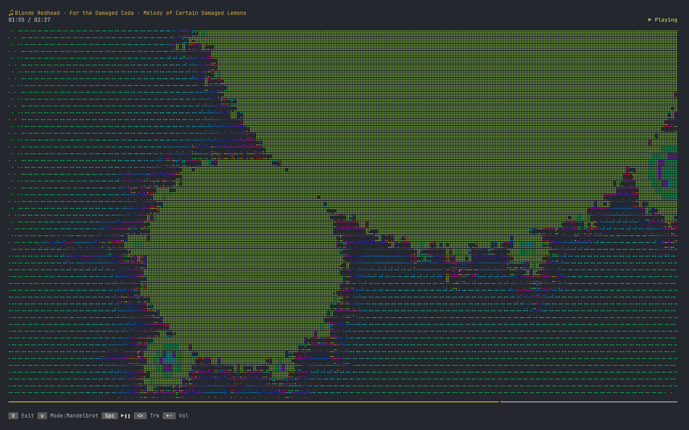

# Mandelbrot Visualizer for cliamp

A psychedelic Mandelbrot set visualizer plugin for [cliamp](https://www.cliamp.stream/), the terminal music player.



## Install

```bash
cliamp plugins install mikkel-bergmann/cliamp-mandelbrot
```

Start `cliamp` and press `v` to cycle through the visualizers until `Mandelbrot` appears.

```sh
cliamp plugins remove mandelbrot
```

## Features

- **Continuous zoom** into four classic Mandelbrot locations (Sea Horse Valley, Elephant Valley, Seahorse spiral arm, Antenna mini-brot), cycling automatically when the interior fills the screen
- **Slow rotation** — the view gently rotates as it zooms, revealing new structure on every pass
- **Bass reactivity** — sub-bass and kick frequencies pulse the color palette; strong hits flash the interior bright
- **Unicode braille rendering** — every terminal cell is a braille character (U+2800–U+28FF); escape-time iteration count maps to dot density (0–8 dots), giving smooth halftone anti-aliasing with no resolution loss
- **Checkerboard dithering** — adjacent cells alternate between fill level N and N+1, doubling effective density levels to ~15 for smoother gradients
- **Period-coloured interior** — Brent cycle detection captures the orbit period of each interior point; main cardioid, period-2 bulb, period-4 spirals etc. each get a distinct cycling hue
- **30-colour psychedelic palette** — ANSI 256-colour cycling through red → orange → yellow → green → cyan → blue → magenta and back
- **Silence detection** — animation freezes when no audio is playing and resumes instantly

## Performance

The renderer is optimised for Lua 5.1's sandboxed environment:

| Technique | Benefit |
|---|---|
| Cardioid / period-2 bulb pre-check | Skips iteration for ~50–70% of interior cells |
| Incremental coordinate stepping | 2 adds per cell instead of 4 multiplications |
| Two-phase Brent cycle detection | Interior exits early; exterior escapes fast |
| Per-frame braille lookup tables | Single indexed read per cell; no hot-path allocation |

## Tuning

Constants at the top of `mandelbrot.lua`:

| Constant | Default | Effect |
|---|---|---|
| `ZOOM_SPEED` | `0.12` | How fast the view zooms in |
| `ROTATION_SPEED` | `0.004` | Degrees of rotation per second |
| `BASE_ITER` | `80` | Minimum iteration depth |
| `MAX_ITER_CAP` | `128` | Maximum iteration depth at deep zoom |
| `BASS_FLASH_THR` | `0.55` | Band level that triggers a colour flash |
| `COLOR_FLOW` | `2.0` | Speed of palette cycling |
| `SOLID_TRIGGER` | `0.99` | Interior fill fraction that triggers a zoom reset |
